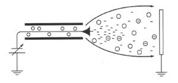
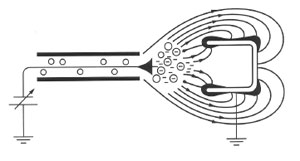
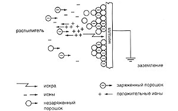
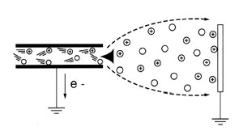
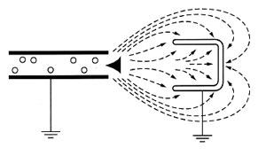

## Технологія нанесення порошкових покриттів

---

Існують різні технології і методи нанесення порошкових покриттів. Електростатичний і трибостатичний методи є найбільш популярними і розповсюдженими.

### Технологія порошкового фарбування електростатичним напиленням.

Мал. 1 - технологія зарядки коронним розрядом

Його популярність обумовлена наступними факторами: вISOка ефективність зарядки майже всіх порошкових фарб, вISOка продуктивність при порошковому фарбуванні великих поверхонь, відносно низька чутливість до вологості навколишнього повітря, підходить для нанесення різних порошкових покриттів зі спеціальними ефектами (Металіки, шагрені, мауари і т.д.).

Поряд з перевагами електростатичне напилення має ряд недоліків, які обумовлені сильним електричним полем між розпилювачем і деталлю, яке може ускладнити нанесення порошкового покриття в кутах і в місцях глибоких виїмок. Крім того, неправильний вибір електростатичних параметрів розпилювача і відстані від розпилювача до деталі може викликати зворотну іонізацію і погіршити якість полімерного порошкового покриття.

Устаткування для порошкового фарбування - електростатичний розпилювач є в комплексі порошкового фарбування Wagner.

Мал. 2 - Ефект клітки Фарадея

На малюнку показано, що при нанесенні порошкового покриття на ділянки, в яких діє ефект клітки Фарадея, електричне поле, створюване розпилювачем, має максимальну напруженість по краях виїмки. Силові лінії завжди йдуть до найближчої заземленої точки і швидше концентруються по краях виїмки і виступаючим ділянкам, а не проникають далі, всередину.

 Це поле прискорює осідання часточок, утворюючи в цих місцях порошкове покриття занадто великої товщини.

Ефект клітки Фарадея спостерігається в тих випадках, коли наносять порошкову фарбу на металовироби складної конфігурації, куди зовнішнє електричне поле не проникає, тому нанесення рівного покриття на деталі утруднено і в деяких випадках навіть неможливо.

Рис. 3 - Зворотна іонізація

Зворотна іонізація викликається зайвим струмом вільних іонів від зарядних електродів розпилювача. Коли вільні іони потрапляють на покриту порошковою фарбою поверхню деталі, вони додають свій заряд до заряду, що накопичився в шарі порошку. Але поверхні деталі накопичується занадто великий заряд. У деяких точках величина заряду перевищується настільки, що в товщі порошку проскакують мікро іскри, що утворюють кратери на поверхні, що призводить до погіршення якості покриття і порушення його функціональних властивостей. Також зворотна іонізація сприяє утворенню апельсинової кірки, зниження ефективності роботи розпилювачів і обмеження товщини одержуваних покриттів.

Для зменшення ефекту клітки Фарадея і зворотної іонізації було розроблено спеціальне обладнання, яке зменшує кількість іонів в іонізованому повітрі, коли заряджені частинки порошку притягуються поверхнею. Вільні негативні іони відводяться в сторону завдяки заземленню самого розпилювача, що значно знижує прояв вищезазначених негативних ефектів. Збільшивши відстань між розпилювачем і поверхнею деталі, можна зменшити струм пістолета розпилювача і уповільнити процес зворотної іонізації.

### Технологія порошкового фарбування трибостатичним напиленням.

Мал. 4 - Трибостатичне напилення-зарядка тертям.

На відміну від електростатичного напилення, в даній системі немає генератора вISOї напруги для розпилювача. Порошок заряджається в процесі тертя.

Головне завдання-збільшити число і силу зіткнень між частинками порошку і заряджаючими поверхнями пістолета розпилювача.

Одним з кращих акцепторів в трибоелектричному ряду є політетрафторетилен (тефлон), він забезпечує хорошу зарядку більшості порошкових фарб, має відносно вISOку зносостійкість і стійкий до налипання частинок під дією ударів.

Мал. 5 - Відсутній ефект клітини Фарадея

У розпилювачах з трибостатичною зарядкою не створюється ні сильного електричного поля, ні іонного струму, тому відсутній ефект клітини Фарадея і зворотної іонізації. Заряджені частинки можуть проникати в глибокі приховані отвори і рівномірно фарбувати вироби складної конфігурації.

Також можливе нанесення декількох шарів фарби для отримання товстих порошкових покриттів.

Розпилювачі з використанням трибостатичної зарядки конструктивно більш надійні, ніж пістолети розпилювачі з зарядкою в поле коронного розряду, оскільки вони не мають елементів, що перетворюють вISOку напругу. За винятком дроту заземлення, ці розпилювачі є повністю механічними, чутливими тільки до природного зносу.

### Газополум'яне напилення.

Газополум'яне напилення здійснюється з використанням розпилювача фарби, в якому термопластичний порошок продувається через полум'я газового пальника стисненим повітрям. При цьому порошок плавиться і в такому вигляді потрапляє на виріб. Оскільки розпилювач фарби є портативним, великі вироби, такі як танки, трубопроводи, Мости, легко можуть мити пофарбовані за даною технологією. Обладнання для газополум'яного напилення універсально. Його використовують для нагрівання поверхні, напилення порошкової фарби і повторного нагрівання з метою вирівнювання поверхні.

### Нанесення в киплячому шарі.

Термореактивні Порошкові фарби, перш за все епоксидні, можуть бути використані для нанесення в псевдозрідженому шарі. Однак більшу частину покриттів в псевдозрідженому шарі отримують із застосуванням термопластичних фарб. В цьому випадку утворюються товсті міцні покриття з відмінними механічними, електричними і протикорозійними властивостями.

Сутність способу полягає в тому, що виріб, нагріте трохи вище температури плавлення порошкового матеріалу, занурюють у ванну, в якій цей матеріал знаходиться в киплячому або псевдозрідженому стані. Частинки матеріалу, що приходять в контакт з виробом, плавляться, утворюючи на його поверхні рівномірний шар. Подальше нагрівання вироби поза ванни покращує розтікання розплаву, а його охолодження завершує процес отримання готового покриття.

Так само використовуються:

1) апарат для вібровихрового нанесення;

2) Пневмовібраційний апарат;

3) Установка "киплячого шару" з індукційним нагріванням;

4) Пневмотичне напилення;

5) Пневмопроменеве напилення.
